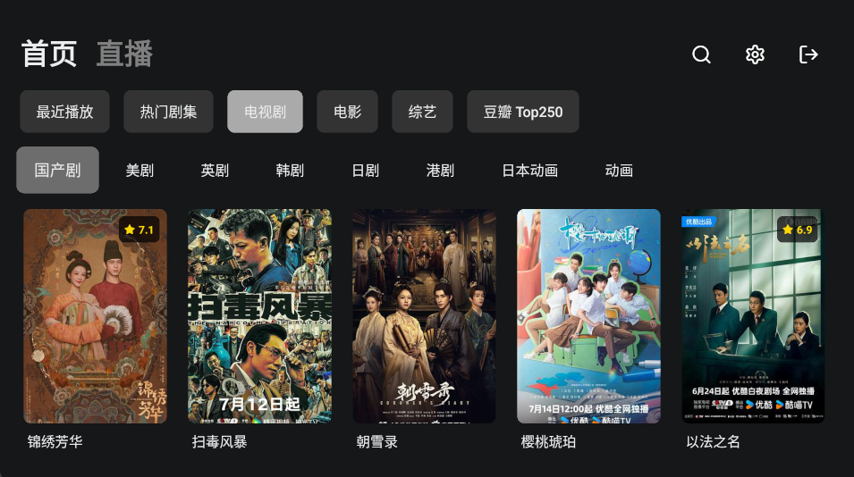
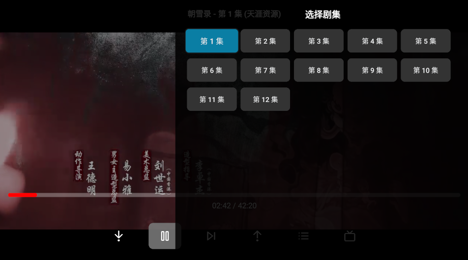
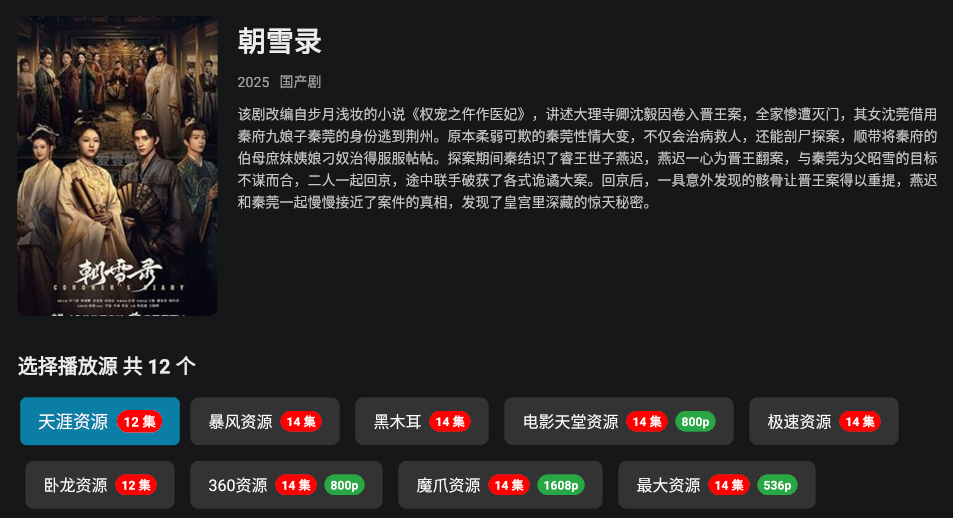

# OrionTV 📺

一个基于 React Native TVOS 和 Expo 构建的跨平台电视应用，旨在提供流畅的视频观看体验。项目包含一个用于数据服务的 Express 后端。

## ✨ 功能特性

- **跨平台支持**: 同时支持 Apple TV 和 Android TV。
- **现代化前端**: 使用 Expo、React Native TVOS 和 TypeScript 构建，性能卓越。
- **Expo Router**: 基于文件系统的路由，使导航逻辑清晰简单。
- **后端服务**: 配套 Express 后端，用于处理数据获取、搜索和详情展示。
- **TV 优化的 UI**: 专为电视遥控器交互设计的用户界面。

## 🛠️ 技术栈

- **前端**:
  - [React Native TVOS](https://github.com/react-native-tvos/react-native-tvos)
  - [Expo](https://expo.dev/) (~51.0)
  - [Expo Router](https://docs.expo.dev/router/introduction/)
  - [Expo AV](https://docs.expo.dev/versions/latest/sdk/av/)
  - TypeScript
- **后端**:
  - [Node.js](https://nodejs.org/)
  - [Express](https://expressjs.com/)
  - [TypeScript](https://www.typescriptlang.org/)

## 📂 项目结构

本项目采用类似 monorepo 的结构：

```
.
├── app/              # Expo Router 路由和页面
├── assets/           # 静态资源 (字体, 图片, TV 图标)
├── backend/          # 后端 Express 应用
├── components/       # React 组件
├── constants/        # 应用常量 (颜色, 样式)
├── hooks/            # 自定义 Hooks
├── services/         # 服务层 (API, 存储)
├── package.json      # 前端依赖和脚本
└── ...
```

## 🚀 快速开始

### 环境准备

请确保您的开发环境中已安装以下软件：

- [Node.js](https://nodejs.org/) (LTS 版本)
- [Yarn](https://yarnpkg.com/)
- [Expo CLI](https://docs.expo.dev/get-started/installation/)
- [Xcode](https://developer.apple.com/xcode/) (用于 Apple TV 开发)
- [Android Studio](https://developer.android.com/studio) (用于 Android TV 开发)

### 1. 后端服务

首先，启动后端服务：

```sh
# 进入后端目录
cd backend

# 安装依赖
yarn

# 启动开发服务器
yarn dev
```

后端服务将运行在 `http://localhost:3001`。

### 2. 前端应用

接下来，在项目根目录运行前端应用：

```sh
# (如果还在 backend 目录) 返回根目录
cd ..

# 安装前端依赖
yarn

# [首次运行或依赖更新后] 生成原生项目文件
# 这会根据 app.json 中的配置修改原生代码以支持 TV
yarn prebuild-tv

# 运行在 Apple TV 模拟器或真机上
yarn ios-tv

# 运行在 Android TV 模拟器或真机上
yarn android-tv
```

## 部署

### 后端部署

#### [Vercel](https://vercel.com/) 部署

[](https://vercel.com/new/clone?repository-url=https%3A%2F%2Fgithub.com%2Fzimplexing%2FOrionTV&root-directory=backend)

#### Docker 部署

1. `docker pull zimpel1/tv-host`

2. `docker run -d -p 3001:3001 zimpel1/tv-host`

#### 使用 demo 地址

在设置中可以使用 demo 地址： https://orion-tv.vercel.app 需要代理且不保证稳定和可用性。

## 📜 主要脚本

- `yarn start`: 在手机模式下启动 Metro Bundler。
- `yarn start-tv`: 在 TV 模式下启动 Metro Bundler。
- `yarn ios-tv`: 在 Apple TV 上构建并运行应用。
- `yarn android-tv`: 在 Android TV 上构建并运行应用。
- `yarn prebuild-tv`: 为 TV 构建生成原生项目文件。
- `yarn lint`: 检查代码风格。

## 📸 应用截图






## 📝 License

本项目采用 MIT 许可证。

## ⚠️ 免责声明

OrionTV 仅作为视频搜索工具，不存储、上传或分发任何视频内容。所有视频均来自第三方 API 接口提供的搜索结果。如有侵权内容，请联系相应的内容提供方。

本项目开发者不对使用本项目产生的任何后果负责。使用本项目时，您必须遵守当地的法律法规。

## 🙏 致谢

本项目受到以下开源项目的启发：

- [MoonTV](https://github.com/senshinya/MoonTV) - 一个基于 Next.js 的视频聚合应用
- [LibreTV](https://github.com/LibreSpark/LibreTV) - 一个开源的视频流媒体应用
